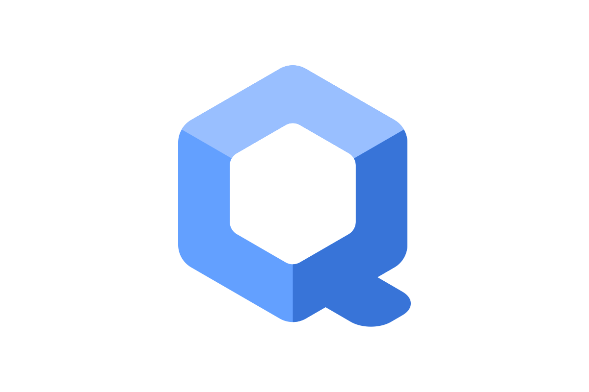

<h1 align="center">

</h1>

**👋 Hii, all I have a strong interest in Cybersecurity and electronics 📡, fueled by my curiosity and commitment to constant learning.....🚀**

**I am actively participating in 🐞 bug bounties and Penetration Testing also possess a 🛡️CEH certification. I find pleasure in discovering and reducing security weaknesses.**

**I am currently working towards obtaining the OSCP certification📚 in order to enhance my skills and make a greater impact in the cybersecurity field......⚡**

 

<h1><strong> My Status</strong></h1>

  
  <a href="https://github.com/R4Tw1z/">

<h2 align="center">I'm diving into and experimenting with a wide range of tools, programming languages, and technologies! 💻🚀🔧</h2>

<table>
  <tr>
    <td align="left" width="100">
      <b>Programming:</b>
    </td>
        <td align="center" width="96">
      
       C
    </td>
        <td align="center" width="96">
      
       C++
    </td>
        <td align="center" width="96"> 
      
       Java
    </td>
    <td align="center" width="96"> 
      
       JavaScript
    </td>
    <td align="center" width="100">
      
       Python
    </td>
    <td align="center" width="96">
      
       Bash
    </td>
      </tr>
  <tr>
    <td align="left" width="100">
      <b>Tools:</b>
    </td>
    <td align="center" width="96">
      
       Nmap
    </td>
        <td align="center" width="96">
      
       Metasploit
    </td>
        <td align="center" width="96">
      
       Wireshark
    </td>
    <td align="center" width="96">
  
   Docker
    </td>
    
        <td align="center" width="96">
      
       Ghidra
    </td>
        <td align="center" width="96">
      
       BurpSuite
    </td>
  </tr>
    <tr>
    <td align="left" width="100">
      <b>Dev Tools:</b>
    </td>
      <td align="center"  width="96">
      
       Git
    </td>
    <td align="center"  width="96">
      
       GitHub
    </td>
    </tr>
  <tr>
    <td align="left" width="100">
      <b>OS:</b>
    </td>
      <td align="center" width="96">
      
       Linux
    </td>
    <td align="center" width="96">
      
       Tails
    </td>
        <td align="center" width="96">
      
       Qubes
    </td>
    <td align="center" width="96">
      
       RaspberryPi
    </td>
    <td align="center" width="96">
      
       BlackArch
    </td>
    </tr>
</table>

